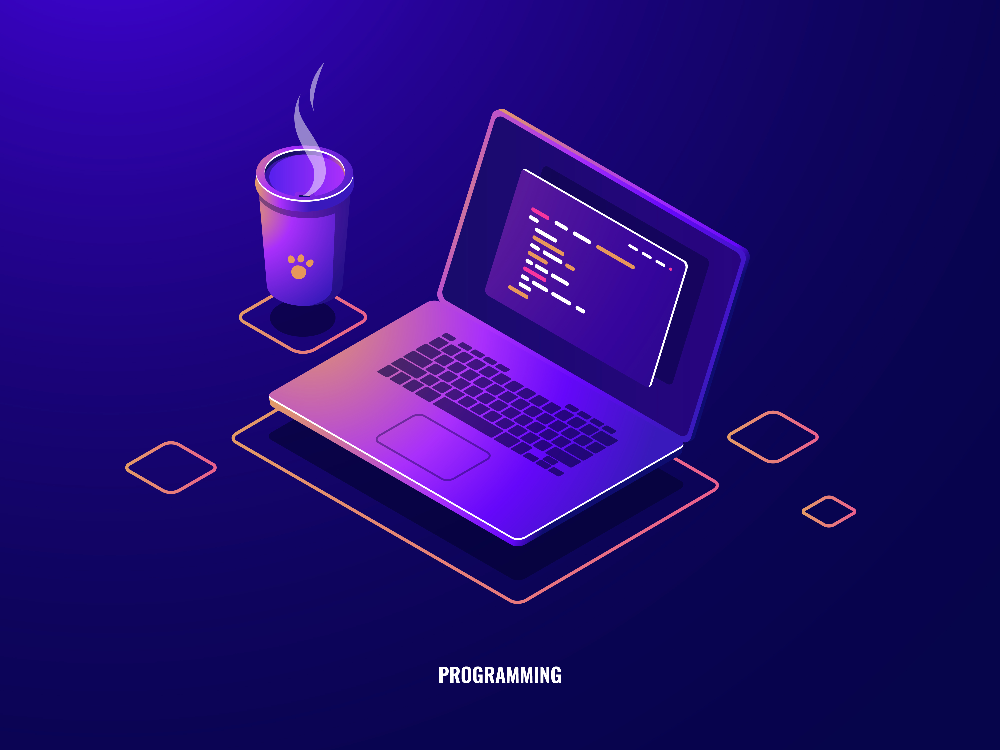

  
  
  

<table>
<tr>
<td valign="top" width="50%">

### 🧑‍💻 About Me

I'm a **DevOps Engineer** from Brazil passionate about building reliable, scalable infrastructure and automating everything that can be automated.

- **Infrastructure as Code** — Terraform
- **Container Orchestration** — Kubernetes & Docker
- **Automation** — Python, Bash & CI/CD
- **Linux Systems** — Admin & Troubleshooting
- Open to **DevOps / Cloud / SRE** roles

</td>
<td valign="top" width="50%">

</td>
</tr>
</table>

<table>
<tr>
<td valign="top" width="50%">

### 🚀 Tech Stack

**Cloud & Orchestration**

  

**Monitoring & Observability**

  
  
  

**Development & Scripting**

  

**Tools & Version Control**

  

</td>
<td valign="middle" width="50%">

</td>
</tr>
</table>

### 
📈 GitHub Analytics

  
  

 

  

### 
🐍 Contribution Graph

<picture>
  <source media="(prefers-color-scheme: dark)" srcset="https://raw.githubusercontent.com/berilovania/berilovania/output/pacman-contribution-graph-dark.svg">
  <source media="(prefers-color-scheme: light)" srcset="https://raw.githubusercontent.com/berilovania/berilovania/output/pacman-contribution-graph.svg">
  
</picture>

  

